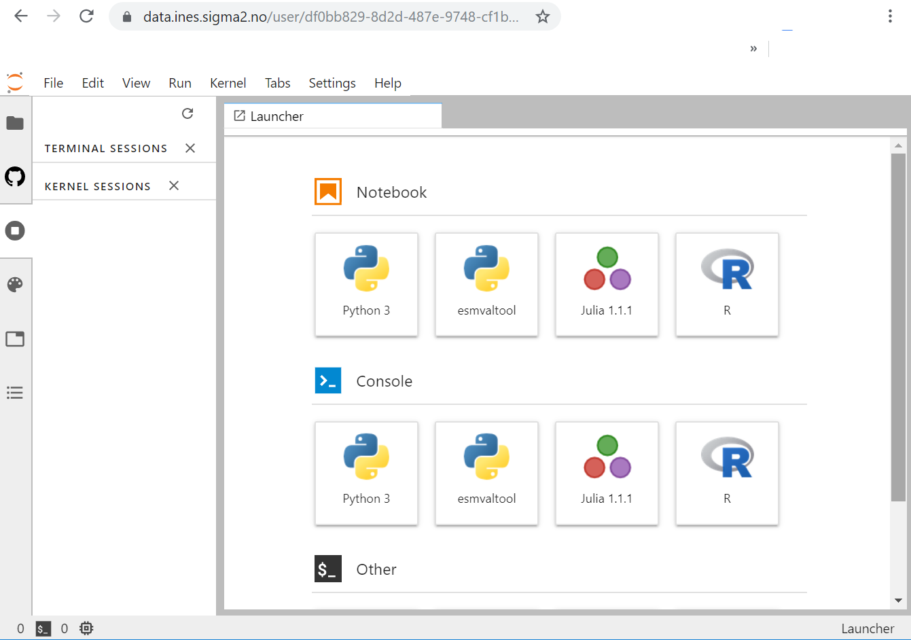

# jupyterhub-nird-toolkit

[Docker image](https://hub.docker.com/r/nordicesmhub/jupyterhub-nird-toolkit) for Jupyterhub NIRD toolkit.

esmvalTool is available in the esmvaltool conda environment in the jupyterhub.

## Activate esmvaltool conda environment in the jupyterhub

Open a terminal in the Jupyterhub:

```
source activate esmvaltool
python -m ipykernel install --user --name=esmvaltool
```

Then restart your server to see esmvaltool environment (as shown on the figure below).




## Using esmvaltool from the command line

Open a terminal in the jupyterhub to setup your environment.

```
source activate esmvaltool
esmvaltool --help
```

The help returns:

```

usage: esmvaltool [-h] [-v] [-c CONFIG_FILE] [-s] [--max-datasets MAX_DATASETS] [--max-years MAX_YEARS] [--skip-nonexistent] [--diagnostics [DIAGNOSTICS [DIAGNOSTICS ...]]] recipe

______________________________________________________________________
          _____ ____  __  ____     __    _ _____           _
         | ____/ ___||  \/  \ \   / /_ _| |_   _|__   ___ | |
         |  _| \___ \| |\/| |\ \ / / _` | | | |/ _ \ / _ \| |
         | |___ ___) | |  | | \ V / (_| | | | | (_) | (_) | |
         |_____|____/|_|  |_|  \_/ \__,_|_| |_|\___/ \___/|_|
______________________________________________________________________

ESMValTool - Earth System Model Evaluation Tool.

http://www.esmvaltool.org

CORE DEVELOPMENT TEAM AND CONTACTS:
  Veronika Eyring (PI; DLR, Germany - veronika.eyring@dlr.de)
  Bouwe Andela (NLESC, Netherlands - b.andela@esciencecenter.nl)
  Bjoern Broetz (DLR, Germany - bjoern.broetz@dlr.de)
  Lee de Mora (PML, UK - ledm@pml.ac.uk)
  Niels Drost (NLESC, Netherlands - n.drost@esciencecenter.nl)
  Nikolay Koldunov (AWI, Germany - nikolay.koldunov@awi.de)
  Axel Lauer (DLR, Germany - axel.lauer@dlr.de)
  Benjamin Mueller (LMU, Germany - b.mueller@iggf.geo.uni-muenchen.de)
  Valeriu Predoi (URead, UK - valeriu.predoi@ncas.ac.uk)
  Mattia Righi (DLR, Germany - mattia.righi@dlr.de)
  Manuel Schlund (DLR, Germany - manuel.schlund@dlr.de)
  Javier Vegas-Regidor (BSC, Spain - javier.vegas@bsc.es)

For further help, please read the documentation at
http://esmvaltool.readthedocs.io. Have fun!

positional arguments:
  recipe                Path or name of the yaml recipe file

optional arguments:
  -h, --help            show this help message and exit
  -v, --version         return ESMValTool's version number and exit
  -c CONFIG_FILE, --config-file CONFIG_FILE
                        Config file
  -s, --synda-download  Download input data using synda. This requires a working synda installation.
  --max-datasets MAX_DATASETS
                        Try to limit the number of datasets used to MAX_DATASETS.
  --max-years MAX_YEARS
                        Limit the number of years to MAX_YEARS.
  --skip-nonexistent    Skip datasets that cannot be found.
  --diagnostics [DIAGNOSTICS [DIAGNOSTICS ...]]
                        Only run the named diagnostics from the recipe.
```

This command needs to be repeated everytime you start a new terminal.


